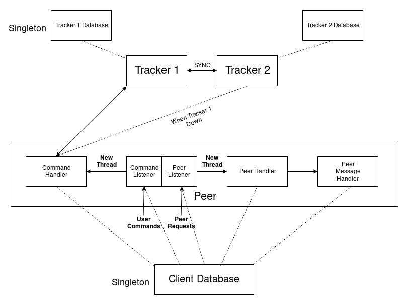
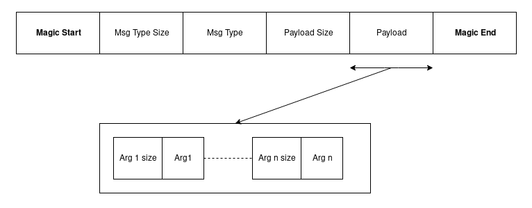

# mtorrent
A bit torrent like file sharing system with fallback multi-tracker system with synchronization and parallel downloading.
Implemented own RPC mechanism, message encoding and methods for message serialization and de-serialization. Used openssl library for computing hash values of files(SHA1)

## Parallel Download algorithm:
1. Create a 2-D map of chunk index - list of peers having that chunk of the file
2. For each chunk index i:
    - Generate a random number x of range (0, len(peer_list_of_chunk))
    - Download chunk i from the peer present at index x

### Message Format

1. Magic start: Indicates the start of a new message
2. Msg Type size: Size(in bytes) of the message type, ie, number of bytes to read to get the message type
3. Msg type: Actual message type(ex: share, etc)
4. Payload size: Size(in bytes) of the entire payload, ie, number of bytes to read to get entire payload
5. Payload: Payload in bytes
6. Magic end: Indicates the end of the message
7. Payload can constitute of a number of arguments, each appened by the arg size(in bytes) to indicate the number of bytes to read to retrive the argument

## Message Types:
Inspired from Protocol buffers, created a generic Message class and used inheritance to create class for each message type.
Implemented class methods for message serialization and de-serialization

1. Share: Share file request to the tracker
2. AddSeeder: Add seeder to the tracker list for a given file
3. RemoveSeeder: Remove seeder from the tracker list for a given file
4. SeederInfoRequest: Get the seeder list for a given file
5. SeederInfoResponse: Response for the Seeder list request
6. ChunkInfoRequest: Get the chunk availability information from peer
7. ChunkInfoResponse: Response for the chunk info request
9. SendChunkRequest: Request to send chunk data based on chunk index
10. SendChunkResponse: Get the chunk data from the peer(download chunk)
11. Response: Response for one directional communications
#### Sync messages
12. SyncShare: Relay of share message to the other tracker
13. SyncAddSeeder: Relay of add seeder request to the other tracker
14. SyncRemoveSeeder: Relay of remove seeder request to the other tracker
15. SyncSeederListRequest: seeder list request to the other tracker during startup of the tracker
16. SyncSeederListResponse: seeder list response for the above request

## Key Classes
#### Client
1. ChunkDownloader - Handles download of all the chunks of a file
2. ChunkSaver - Handles download of single chunk and saves to the file
3. clientDatabase - Singleton class to store all data required by the client
4. commandHandler - Handler to handle all the different user commands
5. download - Creates a download object to store all download related data
6. downloadManager - Singleton class to manage all ongoing and completed downloads
7. fileHandler - Handler to handle all file related operations
8. mtorrent - Creates an mtorrent object to store all data related to mtorrent file
9. peerHandler - Handler to handle all the different peer related requests
10. peerListener - Listens for incoming connections from peers
11. peerMessageHandler - Message specific Handler to handle different requests

#### Tracker
1. fileAttr - Creates an object to store all data related to a single file(ex: hash, seeder list, etc)
2. rpcHandler - Handler to handle all the different client requests
3. trackerMessageHandler - Message specific Handler to handle different requests
4. trackerDatabase - Singleton class to store all data required by the tracker

#### Common Classes
1. Decoder - Class to handle decoding of different messages from raw bytes
2. Encoder - Class to handle encoding of different messages into raw bytes
3. logHandler - Singleton class to handle logging
4. message - Contains classes for each message type(Core part for communication)
5. NetworkInterfacer - Handles interfacing with network(Read/write from network sockets)
6. TrackerServiceServer - Handles communication to single/multiple trackers

## User Commands
1. share <local file path> <filename>.mtorrent : Shares file availability to the network
2. get <path to .mtorrent> <destination path> : Downloads the file to the destination path
3. show downloads: shows the ongoing/completed file downloads
4. remove <filename.mtorrent>: remove sharing of the file by the current user
5. quit: exits application
